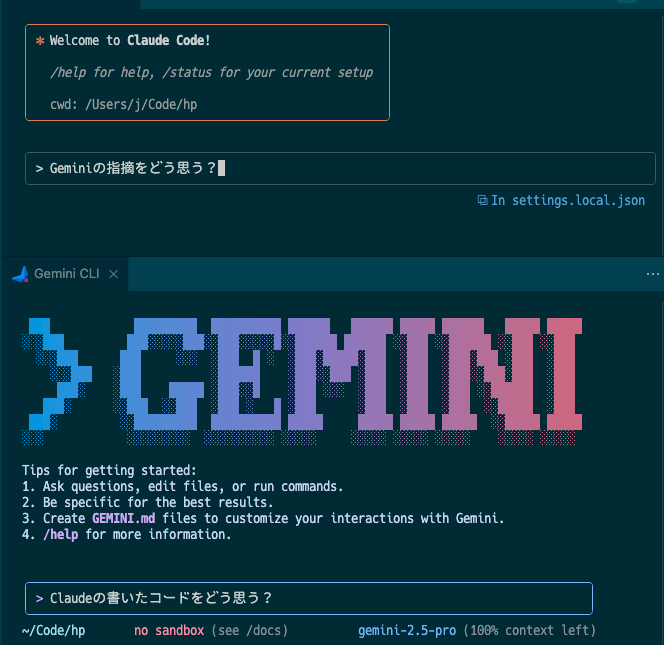

# Gemini CLI on VSCode

**🇯🇵 日本語版** | [🇺🇸 English](README.md)

## 🎨 エディタウィンドウで動くGemini CLI

### ついに実現：Claude Codeと同じ体験をGemini CLIで



## 💡 なぜこの拡張が革新的なのか？

### 🔄 従来の制約

- **Gemini CLI**: 強力だが**ターミナルパネルでしか動作しない**
- **Gemini Code Assist**: エディタ統合されているが**まったく別のツール**
- **Claude Code**: 完璧なエディタ統合だが**Geminiが使えない**

### ✨ この拡張の革新

#### Claude Codeのエディタ統合体験をGemini CLIで実現

- Gemini CLIがエディタウィンドウで直接動作
- ターミナルとエディタの切り替えが不要に
- Claude Codeユーザーが愛するワークフローをGeminiで

## ⚡ 主要機能

### 🖱️ ワンクリック起動

- **エディタタイトルバーのアイコン**で即座にアクセス
- **コマンドパレット**統合
- **新規ペイン**または**アクティブペイン**を選択可能

### 🔧 真のエディタ統合

- ターミナルパネルではなくエディタタブとして開く
- コードファイルと並べて表示
- エディタレイアウトを維持

### 💻 シームレスなワークフロー

- AI支援を使用中もコードを表示し続ける
- ターミナルとエディタ間のコンテキストスイッチが不要
- 開発フローと自然に統合

### 🆕 スマート機能 (v0.0.2)

- **自動ナビゲーション**: ワークスペースフォルダーへ自動移動
- **ターミナル再利用**: 重複作成せず既存のGemini CLIにフォーカス
- **カスタムキーバインド**: 独自のキーボードショートカットを設定可能

## 🚀 クイックスタート

### 前提条件

```bash
# Gemini CLIのインストール（必須）
npm install -g @google/gemini-cli

# 認証（初回のみ）
gemini
# ブラウザでGoogleアカウント認証を完了
```

### 使用方法

1. **VS Codeで任意のプロジェクトを開く**
2. **エディタタイトルバーの ✨（sparkle）アイコンをクリック**
3. **Gemini CLIが新しいエディタペインで起動！**

またはコマンドパレットを使用：

1. **`Cmd+Shift+P`（Mac）または `Ctrl+Shift+P`（Windows/Linux）を押す**
2. **"Gemini CLI" で検索**
3. **お好みの起動モードを選択**

### ⌨️ カスタムキーボードショートカット（任意）

独自のキーバインディングを設定：

1. キーボードショートカットを開く: `Cmd+K Cmd+S`（Mac）または `Ctrl+K Ctrl+S`（Windows/Linux）
2. "Gemini CLI" で検索
3. 鉛筆アイコンをクリックしてお好みのキーを割り当て

競合しにくい推奨ショートカット：
- `Cmd+Shift+Alt+G`（Mac）/ `Ctrl+Shift+Alt+G`（Windows/Linux）
- `Cmd+K G`（Mac）/ `Ctrl+K G`（Windows/Linux）

## 💡 実際の使用例

### コードレビューリクエスト

```bash
# Gemini CLIがエディタペインで起動後
@src/components/Button.tsx このコンポーネントをレビューして改善提案をください
```

### プロジェクトアーキテクチャ分析

```bash
@. プロジェクトのアーキテクチャを分析して、主要な設計パターンを説明してください
```

### エラー解決

```bash
@package.json @src/main.ts ビルドエラーが発生しています。修正方法を教えてください
```

## 🆚 他の選択肢との比較

### 🎯 最適なユースケース

- **Claude CodeのUXが好きだがGeminiを使いたい**開発者
- ターミナルベースのAIツールを好む**パワーユーザー**
- ターミナルとエディタの切り替えに**うんざりしている**人
- すでにGemini CLIを使用している**チーム**

### 📊 比較表

| 機能 | Gemini CLI | この拡張 | Gemini Code Assist | Claude Code |
|------|-------------------|----------|--------------------------|----------------|
| **エディタペインで動作** | ❌ | ✅ | ❌（サイドバー） | ✅ |
| **Geminiモデルを使用** | ✅ | ✅ | ✅ | ❌ |
| **ワンクリック起動** | ❌ | ✅ | ✅ | ✅ |
| **無料で使用** | ✅ | ✅ | ✅（6000回/日） | ❌（$20/月） |
| **ターミナルベースインターフェース** | ✅ | ✅ | ❌ | ✅ |
| **ファイルコンテキスト（@）** | ✅ | ✅ | ✅ | ✅ |
| **コード生成** | ✅ | ✅ | ✅ | ✅ |

## 🛠️ 開発

### ローカル開発

```bash
git clone https://github.com/d3j/gemini-cli-on-vscode.git
cd gemini-cli-on-vscode
npm install
npm run compile
```

### デバッグ

1. VS Codeでプロジェクトを開く
2. `F5` を押してExtension Development Hostを起動
3. 新しいVS Codeウィンドウで拡張機能をテスト

## 🐛 トラブルシューティング

### よくある問題

#### Q: "gemini: command not found" エラー

```bash
# 解決策：Gemini CLIをインストール
npm install -g @google/gemini-cli
```

#### Q: 認証エラー

```bash
# 解決策：最初にターミナルで直接認証
gemini
# ブラウザ認証を完了してから、拡張機能を再試行
```

#### Q: エディタタイトルバーに拡張機能が表示されない

- アクティブなエディタが開いていることを確認
- VS Codeウィンドウをリロード（`Cmd+R` / `Ctrl+R`）してみる

## 🤝 コントリビューション

バグ報告、機能リクエスト、プルリクエストを歓迎します！

- **バグ報告**: [Issues](https://github.com/d3j/gemini-cli-on-vscode/issues)
- **機能リクエスト**: [Issues](https://github.com/d3j/gemini-cli-on-vscode/issues)
- **プルリクエスト**: [Pull Requests](https://github.com/d3j/gemini-cli-on-vscode/pulls)


## 🙏 謝辞

- [Gemini CLI](https://github.com/google-gemini/gemini-cli) by Google
- [Claude Code](https://claude.ai/claude-code) by Anthropic
- VS Code Extension開発者コミュニティ

---

## 📈 この拡張を気に入ったら

⭐ **GitHubでスターをお願いします！**
🐛 **バグを見つけたら報告してください**
💡 **機能アイデアを共有してください**
📢 **チームで共有してください**

[⭐ GitHubでスター](https://github.com/d3j/gemini-cli-on-vscode) | [🐛 バグ報告](https://github.com/d3j/gemini-cli-on-vscode/issues) | [💡 機能リクエスト](https://github.com/d3j/gemini-cli-on-vscode/issues)

## 📄 ライセンス

MIT License - 詳細は[LICENSE](LICENSE)ファイルを参照

## 👤 作者

**Joji Jorge Senda** ([@d3j](https://github.com/d3j))

---

AIコーディングアシスタントを使用中にターミナルとエディタを切り替える日々のフラストレーションから生まれました。この拡張は両方の世界のベストを提供します - Claude Codeのエレガントなエディタ統合とGemini CLIの強力な機能を。このドキュメントは陳腐な機能拡張を世界を変えるほど壮大な機能の様に思わせる機能を期待しています。でも、それでいいのかもしれません。小さなツールでも、誰かの小さな問題を解決できれば世界は少し良くなる。
